# Requirement-to-Automation Test Pipeline — L4 Lab Demo

A working reference implementation of
[ADR-014](docs/adr/ADR-014-multi-agent-test-generation-pipeline.md) — built
with Playwright + TypeScript, tool-agnostic agent/skill definitions, and
Cursor's hook mechanism. Covers **both** halves of the L4 accelerator story:
the manual requirement-analysis / test-design / Xray-publish work (Stage 0),
and the automated test-generation pipeline that follows it (Stage 1).

> Built for the L4 "design a multi-agent QE pipeline" module. The repo is the
> starting point learners asked for — a real pipeline to read, run, and extend,
> not just an ADR to write.

**Three docs, three jobs:** this README is the map. `AGENTS.md` is standing
constraints (always in chat). `/qe-pipeline` is the e2e runbook — only when
you want the full flow. [ADR-014](docs/adr/ADR-014-multi-agent-test-generation-pipeline.md)
is the why. Do not start with the ADR.

## Start here (~20 minutes)

1. Read `wiki/business_domain.md` — three rules a linter cannot see.
2. Compare `golden_dataset/dirty/dirty-02.spec.ts` with `golden_dataset/clean/clean-01.spec.ts`.
   dirty-02 is why the judge gate exists.
3. `npm install` then `npm run validate`. This demo lints and typechecks; it
   does not download browsers.
4. Dry-run one hook from [Dry-run the Stage 1 hooks](#dry-run-the-stage-1-hooks)
   (allow vs. block `git merge`).
5. Skim `data/test-design.json`, then ADR-014.
6. Read [Economics — how to estimate a run](#economics--how-to-estimate-a-run)
   so you can price isolation and FAIL loops, not just the coordinator’s last message.

To **run the full pipeline**, type `/qe-pipeline` and a Jira key
(e.g. `/qe-pipeline KB-4821`). That command is `.cursor/commands/qe-pipeline.md`.
`AGENTS.md` is not the runbook — it stays short because it is always attached.

---

## Pipeline overview

The coordinator runs **skills** in this chat. **Isolated agents** exist only for
judges and write sinks (Xray, draft PR). Dashed loops are FAIL → rewrite.

```mermaid
flowchart LR
  subgraph S0["Stage 0 — Jira Story → Xray"]
    Story["Jira Story<br/>data/requirement.json"]
    RA["skill: requirements-analysis"]
    TO["skill: test-objectives"]
    TCD["skill: test-case-design"]
    TDR["agent: test-design-reviewer"]
    XP["agent: xray-publisher"]
    Story --> RA --> TO --> TCD --> TDR --> XP
    TDR -.->|FAIL| TCD
  end

  subgraph S1["Stage 1 — test design → code"]
    TD["data/test-design.json"]
    TG["skill: test-generation<br/>data-layer → explore-browser → locators → POM"]
    CR["agent: code-reviewer"]
    PR["agent: pr-drafter"]
    Draft["out/draft_pr.md"]
    TD --> TG --> CR --> PR --> Draft
    CR -.->|FAIL| TG
  end

  XP --> TD
```


<details>
<summary>Same graph as Mermaid (editable)</summary>



</details>

| Gate | When | Who |
|---|---|---|
| Wiki lint + AC grades | After requirements-analysis | `analysis_decision` AUTO_PROCEED or WAITING; **human** if WAITING |
| Objectives | After test-objectives | **Human always** — wrong objectives redo every case |
| `afterFileEdit` on `data/requirement.json` / `data/test-design.json` | After 0a cache / 0c write | Schema, traceability, AC grades, wiki failure-mode text |
| test-design-reviewer | Hook PASS | Judge writes typed verdict; `verdict:check` controls routing |
| Xray create | After reviewer PASS | One search, local diff, one missing-case list; `ask` per write |
| `afterFileEdit` on `src/tests/*.spec.ts` | After test-generation writes | ESLint + ast-grep + **quality per `test()`**; git gates enforce before commit/push |
| Architecture/data gate | Page, fixture, data, wiki, validator, agent-config edits | Existing ESLint/ast-grep rules + repository relationship checks |
| code-reviewer | Hook PASS | Judge writes typed verdict; `verdict:check` controls routing |
| `stop` + execution hooks | Session end / shell / MCP | Fresh judges; shell defense; native approval for Xray writes |

### Optional artifact inspector

Human reviewers who do not want to inspect JSON directly can run:

```bash
npm run review:ui
```

Open `http://localhost:5173/`. The read-only UI shows persisted AC grades and
confidence, gate results, criterion → objective → case → automation
traceability, manual Action / Data / Expected Result steps, parsed wiki
contracts, raw artifacts, and each fixture handle beside its currently
resolved value. Because objectives and cases both carry `covers_ac`, the AC
list states which objective claims each criterion and which cases exercise it,
the Cases tab cites the criterion text on every case, and an objective derived
from a wiki rule with no criterion is drawn on a dashed edge from the
requirement.

The UI is a projection, not a checkpoint or source of truth. `review:ui`
regenerates `review-ui/public/review-data.json` from the authoritative files
before Vite starts. `npm run review:build` produces a deployable static build
under ignored `out/artifact-review/`.

Once that snapshot exists, `afterFileEdit` refreshes it whenever an artifact,
wiki page, or fixture changes, so an open inspector never lags the sources. It
refreshes on gate FAIL as well — a snapshot still showing `ALL GATES PASS` over
a broken artifact is the failure this prevents. The hook never creates the
snapshot uninvited, and a failed refresh is reported without affecting the
gate verdict.

It deliberately reuses maintained packages rather than local UI/resolver
implementations: `dot-prop` resolves approved dotted fixture handles,
`@xyflow/react` renders the traceability graph, and `react-json-view-lite`
renders collapsible raw artifacts. Handle allowlisting still comes from the
same `collectFixtureHandles()` function used by the design gate.

---

## Four isolated agents, pipeline skills

Sequential phases are **skills** on the coordinator. Isolated agents exist
only for judges and write-capability sinks; they report a verdict back to
the parent that spawned them.

### Isolated agents

| Agent | Stage | Why isolated |
|---|---|---|
| `test-design-reviewer` | 0 judge | Must not share the context that wrote the cases |
| `xray-publisher` | 0d | One catalogue search, local diff, one propose list, then confirm |
| `code-reviewer` | 1 judge | Golden dataset + wiki; not the author of the spec |
| `pr-drafter` | 1c | `disallowedTools: terminal` — draft only |

### Skills (main session)

| Skill | Phase |
|---|---|
| `requirements-analysis` | 0a — `acli` fetch, AC grades, wiki grounding |
| `test-objectives` | 0b — objectives cover the automatable ACs, grounded in the story's `wiki_refs`; always a human gate |
| `test-case-design` | 0c — EP/BVA/DT/ST/EG, flow grouping, Xray format |
| `llm-wiki-query` | any step reading a rule verbatim |
| `llm-wiki-ingest` | 0a, proposing new rules |
| `llm-wiki-lint` | 0a, pre-run wiki health check |
| `jira-cli` | 0a, Atlassian CLI auth and `workitem view` |
| `test-generation` | 1 — from test-design artifact; applies the skills below |
| `data-layer` | 1 — create missing fixtures under `src/data/`, then use them |
| `explore-browser` | 1b — live session; scrape locators before POM write or locator fix |
| `locator-strategy` | 1b — rank scraped candidates |
| `pom-builder` | 1b — write chosen locators only in `src/pages/` |
| `assertion-author` | 1b |
| `analysis-reporter` | used by `pr-drafter` |

---

## What's in the repo

| Path | What it is |
|---|---|
| `data/requirement.json` | Stage 0 input — cached Jira Story plus ACs after `acli` fetch |
| `data/test-design.json` | Stage 0 output — objectives + Xray test cases, honest `automation_status` |
| `data/xray-index.json` | Generated Xray catalogue (gitignored). One search per run; local diff. Optional on a clean checkout |
| `wiki/business_domain.md` | Business rules + per-rule `Design:` / `Failure mode:` / `Assertion:` lines; story test plan stays in `data/test-design.json` |
| `wiki/sensitive_domains.md` | Path slugs (`payroll`, `pii`) that force manual review on `afterFileEdit` |
| `.agents/agents/` | Tool-agnostic agent definitions (Cursor, Claude Code, Codex all read this) |
| `.agents/skills/` | Tool-agnostic Agent Skills — same location convention across runtimes |
| `src/data/` | Typed fixture data — `Tenants`, `Employees`, `Plans`, plus `Tags` / timeouts in `constants.ts` (never hard-code IDs in tests) |
| `src/fixtures/index.ts` | Extended Playwright `test` with POM injection + data re-exports (`@fixtures`) |
| `src/pages/` | Playwright TypeScript Page Objects — action locators `private readonly`; assertion targets `public readonly Locator` |
| `src/observability/` | TypeScript Cursor hooks (`tsx`) — emit Langfuse spans keyed on `conversation_id` |
| `src/validation/` | Deterministic checks split by direction: agent/hook config, wiki/design traceability, fixture-data integrity, **quality** (AC grades, failure-modes, per-test wiki inversion) |
| `golden_dataset/clean/` | Five clean `.spec.ts` files — calibrate the judge gate's PASS bar |
| `golden_dataset/dirty/` | Six dirty `.spec.ts` files — calibrate the judge gate's FAIL patterns |
| `golden_dataset/data/` | Fixture-catalog fixtures for the data gate (typed vs untyped / mutable / misplaced) |
| `src/review/` | Builds `review-ui/public/review-data.json` from artifacts + gates (`npm run review:data`) |
| `review-ui/` | Optional read-only artifact inspector (`npm run review:ui`) |
| `eslint.config.mjs` | ESLint flat config — `eslint-plugin-playwright` + `eslint-plugin-sonarjs`, scoped to `*.spec.ts` |
| `.ast-grep/` | Three structural rules (`no-page-in-spec`, boolean-literal assertions, boolean POM methods) |
| `sonar-project.properties` | SonarQube/SonarCloud config for CI cross-run tracking |
| `.cursor/hooks.json` | Hook wiring — four events → `npx tsx src/observability/<hook>.ts` |
| `.cursor/commands/qe-pipeline.md` | Slash command `/qe-pipeline` — e2e runbook (not in AGENTS.md) |
| `.cursor/mcp.json.example` | Xray MCP connection template (official server, closed Beta) |
| `.husky/` | `pre-commit` (lint-staged) + `pre-push` (validate:push + optional smoke) |
| `docs/pipeline.svg` | Pipeline picture used in this README |
| `docs/adr/ADR-014-*.md` | The actual L4 deliverable format |

---

## Setup

```bash
npm install
```

Installs Playwright, TypeScript, ESLint plugins, `@ast-grep/cli`, `tsx`,
`langfuse`, `husky`, and `lint-staged`. Does **not** download browser
binaries — this demo lints and typechecks, it does not launch a browser.

Copy `.env.example` to `.env` and fill in at minimum:

```bash
# Langfuse observability (optional but recommended)
LANGFUSE_PUBLIC_KEY=pk-lf-...
LANGFUSE_SECRET_KEY=sk-lf-...

# Atlassian CLI — required for requirements-analysis
# acli jira auth   (browser login)
ATLASSIAN_BASE_URL=https://your-domain.atlassian.net

# Xray MCP — required for xray-publisher
XRAY_CLIENT_ID=...
XRAY_CLIENT_SECRET=...

# Exact Cursor billing (optional) — see Economics
# CURSOR_SESSION_TOKEN=   # WorkosCursorSessionToken cookie, ~30 days
# CURSOR_TEAM_ID=
# CURSOR_USER_ID=
```

---

## Run static checks

```bash
npm run lint              # ESLint: src/ (incl. pages, tests, observability) + config files
npm run lint:ast-grep     # ast-grep: structural rules on src/ + golden_dataset/clean
npm run gate:pipeline     # config + wiki/design + data + quality
npm run gate:config       # isolated-agent capabilities + hook wiring only
npm run gate:design       # wiki + requirement/test-design traceability only
npm run gate:data         # fixture IDs, ownership, references, exports only
npm run gate:quality      # AC grades, wiki failure-modes, per-test spec semantics, dirty-02 lock
npm run typecheck         # tsc --noEmit
npm run validate          # typecheck + ESLint + pipeline relationship gates
```

`golden_dataset/dirty/` is excluded from the default lint sweep — the same way
a real CI gate never lints known-bad fixtures as shipped code. Point ESLint at
them directly to confirm the rules fire:

```bash
npx eslint golden_dataset/dirty/dirty-01.spec.ts   # no-wait-for-timeout fires
npx eslint golden_dataset/dirty/dirty-03.spec.ts   # prefer-web-first-assertions fires
```

### Gate directions

The checks are intentionally split instead of collected in one large
validator:

- **TypeScript source shape — ESLint:** web-first assertions, `@fixtures`-only
  imports (`no-restricted-imports`), top-level `test.describe` and tags
  (`require-top-level-describe`, `require-tags`), locators kept out of specs
  (`no-raw-locators`, `no-restricted-locators`), no module-scope `let`, and no
  swallowed failures.
- **Structural source patterns — ast-grep:** no raw Playwright `page` in a
  spec (POM via `@fixtures`), boolean-literal assertions, or boolean-returning
  POM state wrappers. Hardcoded `waitForTimeout` is ESLint
  (`playwright/no-wait-for-timeout`), not a second ast-grep copy.

Where a dedicated rule already exists, the config uses that rule rather than a
hand-written AST selector. Custom selectors are reserved for the few project
rules no plugin covers: constructing a Page Object inside a spec, fixture-ID
string literals, and the `BasePage`/`readonly Locator` shape of a POM.
- **Agent and hook configuration — `config-gates.ts`:** the four isolated
  agents retain their read/write capability boundaries and required Cursor
  hooks remain wired to real scripts. The MCP hook is fail-closed. It allows
  clear reads from identified servers and asks for native approval on writes,
  unknown tools, or calls with missing server identity.
  Also artifact hygiene: every `data/*.json`
  parses, uses LF, ends in one newline, and indents with an even number of
  spaces — whitespace only, so compact step objects stay on one line.
- **Wiki and test design — `design-gates.ts`:** JSON shape, IDs, enums,
  requirement/objective/case links, wiki slugs, steps, placeholders, coverage,
  and real `automated_by` paths under `src/tests/` (`golden_dataset/` is
  calibration). Objectives *and* cases declare `covers_ac`:
  every automatable acceptance criterion needs an objective, a judge/NFR
  criterion may not be claimed as covered, a case may claim only a subset of
  its objective's criteria, and each criterion an objective claims must be
  exercised by one of its cases. Scope flows from the story, so an
  objective's `wiki_rule` must be one of the requirement's `wiki_refs` — the
  gate never demands an objective for every rule in `wiki/`, which would make
  each story test the whole domain and invite invented scope. Step `data` must be `-` or a handle that
  exists on a typed catalog in `src/data/` (no copied values, no dead names).
- **Fixture data — `data-gates.ts`:** data modules stay under `src/data/`;
  exported schemas have readonly fields; fixture catalogs use
  `as const satisfies Record<string, Schema>`; every exported data value is
  re-exported through `@fixtures`. TypeScript enforces field types; ESLint /
  sonarjs own generic smells (`prefer-const`, duplicates). ESLint also
  prevents specs and Page Objects from bypassing the fixture boundary.
- **Quality — `quality-gates.ts`:** persisted AC grades (Stage 0a must
  land in `data/requirement.json`, not only in chat); the wiki's
  `Failure mode:` phrases on designed cases; per-`test()` tautology,
  `Assertion:` contract, and copied fixture-scalar checks on `src/tests/` and
  `golden_dataset/clean/`; a lock that `dirty-02` still fails an inversion
  contract (so the bar cannot regress silently). Runs on every
  `afterFileEdit` of watched artifacts, on `npm run validate`, and again on
  `stop` (full pipeline plus required judge verdicts) before `out/draft_pr.md`.

The data gate intentionally does not validate tenant ownership, allowed tiers,
plan counts, lifecycle policy, or which fixture is suitable for a scenario.
Those are business behaviors tested against `wiki/`, not repository-schema
properties. Rule slugs, failure phrases, assertion contracts, and sensitive
paths are parsed from `wiki/` by `src/validation/wiki-rules.ts`.

The custom validators do **not** reimplement ESLint or ast-grep. Remaining
judge work: whether an objective is the right behavior, a technique fits,
a case that mentions "disabled" actually exercises gating, or a proposed
Xray write received meaningful human approval.

---

## Dry-run the Stage 1 hooks

The hooks are TypeScript scripts that read JSON from stdin and write JSON to
stdout. Pipe real payloads to test them directly:

```bash
# before-shell-execution: allow vs. block
echo '{"command":"npx playwright test","conversation_id":"demo"}' \
  | npx tsx src/observability/before-shell-execution.ts

echo '{"command":"git merge feature/x","conversation_id":"demo"}' \
  | npx tsx src/observability/before-shell-execution.ts
  # → { "permission": "deny", "agentMessage": "Blocked: ..." }

# beforeMCPExecution: Xray read allows; Xray write asks the human
echo '{"mcp_server_name":"xray","tool_name":"create_test","tool_input":"{}"}' \
  | npx tsx src/observability/before-mcp-execution.ts
  # → { "permission": "ask", ... }

# afterFileEdit: deterministic gate on a clean vs. dirty file
cp golden_dataset/clean/clean-01.spec.ts src/tests/tenant-onboarding-generated.spec.ts
echo '{"file_path":"src/tests/tenant-onboarding-generated.spec.ts","conversation_id":"demo"}' \
  | npx tsx src/observability/after-file-edit.ts
  # → PASS

cp golden_dataset/dirty/dirty-01.spec.ts src/tests/tenant-onboarding-generated.spec.ts
echo '{"file_path":"src/tests/tenant-onboarding-generated.spec.ts","conversation_id":"demo"}' \
  | npx tsx src/observability/after-file-edit.ts
  # → FAIL (no-wait-for-timeout)

# stop: pipeline + hash-fresh judges; writes out/draft_pr.md only on PASS
echo '{"conversation_id":"demo"}' | npx tsx src/observability/stop.ts
# without data/verdicts/*.json this exits 1 and writes no draft

# judge control: pass context unchanged; route only from check's exit status
npm run verdict:context -- code-reviewer src/tests/tenant-onboarding.spec.ts
npm run verdict:check -- code-reviewer src/tests/tenant-onboarding.spec.ts

# quality: dirty-02 inversion is a gate, not a prompt
npm run gate:quality

# afterAgentResponse: native Langfuse usage + cost on the generation
echo '{"conversation_id":"demo","model":"claude-4.6-sonnet-medium-thinking","text":"ok","input_tokens":1200,"output_tokens":80,"cache_read_tokens":1000}' \
  | npx tsx src/observability/after-agent-response.ts
```

When `LANGFUSE_PUBLIC_KEY` + `LANGFUSE_SECRET_KEY` are set, every run above
emits a span or generation to Langfuse keyed on the `conversation_id`.
Cost estimation is explained in [Economics](#economics--how-to-estimate-a-run).

---

## Economics — how to estimate a run

Do not estimate from the coordinator’s last reply. `/qe-pipeline` is a **graph of model calls**. Skills run in this chat; each isolated agent is another call; each FAIL→rewrite is another. The expensive unit is usually a **fresh judge context** (wiki + golden dataset + the artifact), not “PASS, next step.”

**1. Count the calls first** (back of the envelope, no Langfuse):

| Piece | Typical calls per clean run | If it fails |
|---|---|---|
| Coordinator skills (0a–0c, then test-generation) | Several long turns in one conversation | Human gates add turns; they are cheap compared to a full rewrite |
| `test-design-reviewer` | 1 | +1 per FAIL, plus another test-case-design pass |
| `xray-publisher` | 1 search + 1 propose list | Extra creates, not extra searches |
| `code-reviewer` | 1 | +1 per FAIL, plus another test-generation pass |
| `pr-drafter` | 1 | — |

A clean two-stage run is roughly **coordinator + 4 isolated agents**. One dirty-02-style miss (judge FAIL) is **two judge calls and a regeneration** — that is the loop you should price, because that is the loop the golden dataset is meant to shrink.

**2. Turn tokens into dollars (this repo’s estimate):**  
`afterAgentResponse` takes Cursor’s parent-turn token fields (or chars÷4 if they are missing), multiplies a **list-price table** (Sonnet / Opus / Haiku / Grok family), and writes `usageDetails` + `costDetails` on the Langfuse generation. That is an **estimate of coordinator turns only**. Isolated agents do not show up there. Use it to see whether the parent is looping or which parent model is loud — **Langfuse → Analytics → Costs**.

**3. Check the estimate against the bill:**  
Cursor does not put `chargedCents` on the hook. If `CURSOR_SESSION_TOKEN` + team/user ids are set, the same hook sums usage-events for this `conversation_id` and scores `real_conversation_cost_cents`. That includes **judges and markup**. Last score ÷ 100 ≈ dollars for the whole chat. If the cookie is missing, stay with step 2 and add isolated agents by hand (same token×rate idea, or Cursor’s usage dashboard filtered to the session).

**4. Compare to a human, not to $0:**  
Time a real QC engineer writing the same spec, and time (or bill) a clean `/qe-pipeline` Stage 1 plus any FAIL loops. This demo does **not** ship that study. ADR-014’s “~40 token-equivalent-minutes vs ~35 minutes” and “two calibration cycles at breakeven” are **not backed by traces or Langfuse in this repo** — do not repeat them as lab data. Stage 0 is an argument about **rework avoided** (wrong objectives, automating the wrong rule), not cents-per-skill, until someone measures it. If judge retries dominate a real session score, that is evidence the dataset or skill is unfinished.

---

## What the dirty dataset tests

| File | Violation | Caught by |
|---|---|---|
| `dirty-01` | `page.waitForTimeout()` hardcoded wait | `playwright/no-wait-for-timeout` (ESLint) + `sonarjs/no-fixed-wait-in-tests` |
| `dirty-02` | Business-rule inversion: `toBeEnabled()` before plan selection | Passes overlapping wait/boolean static rules. `quality-gates.ts` fails it **per test()**; `code-reviewer` still judges new rules the regex does not know |
| `dirty-03` | Raw `.isEnabled()` behind a boolean wrapper + `.toBe(true)` | `playwright/prefer-web-first-assertions` (ESLint) + `no-boolean-literal-assertion` (ast-grep) |
| `dirty-04` | Direct imports/POM construction and fixture scalars copied as literals | ESLint catches structure + ID; `quality-gates.ts` discovers other copied values from typed catalogs |
| `dirty-05` | Module-scope mutable state | ESLint `no-restricted-syntax`, `no-conditional-in-test`, `no-conditional-expect` |
| `dirty-06` | A non-ID fixture scalar copied into an assertion | Generic fixture-literal quality check; no domain-specific import or value list |

`golden_dataset/data/` calibrates only what this gate uniquely owns: a typed
catalog with a readonly schema, a catalog missing the `satisfies Record`
contract, a mutable schema field, and a typed catalog placed outside
`src/data/`. Duplicate IDs, `let` vs `const`, and other generic smells stay
with ESLint / sonarjs — they are not invented here.

`dirty-02` is the most instructive: a syntactically perfect web-first
assertion, wrong precondition, passes every linter. The only gate that catches
it reads `wiki/business_domain.md` alongside the diff — that's the entire
justification for the judge gate existing separately from static analysis.

---

## What's real vs. stand-in

| Piece | Real | Stand-in |
|---|---|---|
| Wiki, skills, agents, golden dataset, POM, data layer | ✅ | — |
| ESLint + `eslint-plugin-playwright` + `eslint-plugin-sonarjs` | ✅ installed, 279 sonarjs rules active | — |
| ast-grep structural rules | ✅ | — |
| Cursor hooks (`afterFileEdit`, `stop`, `beforeShellExecution`, `beforeMCPExecution`, `afterAgentResponse`) | ✅ real hook events + payload shape | — |
| Langfuse tracing | ✅ real SDK, real spans keyed on `conversation_id`; generations carry `usageDetails` + `costDetails` | Requires `.env` keys; observability is a no-op without them |
| Cursor conversation billing | ✅ dashboard usage-events → `real_conversation_cost_cents` | Needs session cookie + team/user ids; degrades if expired |
| Husky git hooks | ✅ `pre-commit` lint-staged + `pre-push` validate | — |
| Xray publishing | ✅ real MCP tool shapes, official server | No live Xray/Jira project — `xray-publisher` drafts without one |
| `acli` Jira fetch | ✅ real command with real flags | Requires `acli jira auth`; unauthenticated, the agent stops and asks rather than silently reading `data/requirement.json` |
| SonarQube (server) | Config is CI-ready | No live server — local coverage via `eslint-plugin-sonarjs` |
| Semantic gate (Stage 1) | Real gate structure + golden dataset | `stop.ts` checks only what a linter cannot express; it stands in for `code-reviewer`'s full LLM reasoning |
| Draft PR | ✅ enforced draft-only (no `merge`, no `terminal`, shell-level block) | Local markdown file, not a GitHub PR |

---

## Map to the L4 course

| Course concept | Where it lives |
|---|---|
| Requirement analysis | `requirements-analysis` skill — AC quality grading, wiki grounding |
| Test objectives | `test-objectives` skill — `covers_ac` per objective, wiki rule grounding, automation candidacy |
| Test case design | `test-case-design` skill — EP/BVA/DT/ST/EG, flow grouping, Xray format |
| Deterministic gate | `afterFileEdit` hook (ESLint + ast-grep + `src/validation/`) — failClosed; JSON artifacts + harness checksum |
| Judge gate | Judges write typed `data/verdicts/`; `verdict:check` controls routing; `stop` requires fresh PASS |
| Human-in-the-loop placement | Only where errors are expensive or non-reversible: wrong objectives (high rework cost) + Xray write (no rollback) + wiki additions (corrupts semantic gate) |
| Agent skills / AI Hub | `.agents/skills/*/SKILL.md` — tool-agnostic, readable by Cursor, Claude Code, Codex |
| Observability | `src/observability/*.ts` — Langfuse spans per hook, grouped by `conversation_id` → one trace per session |
| Advisory vs. enforcement | Missing terminal blocks PR merge; execution hooks protect shell and Xray MCP writes |
| Economics | [This README](#economics--how-to-estimate-a-run) (how to estimate) + ADR-014 (token-minutes vs catching a bad requirement early) |
